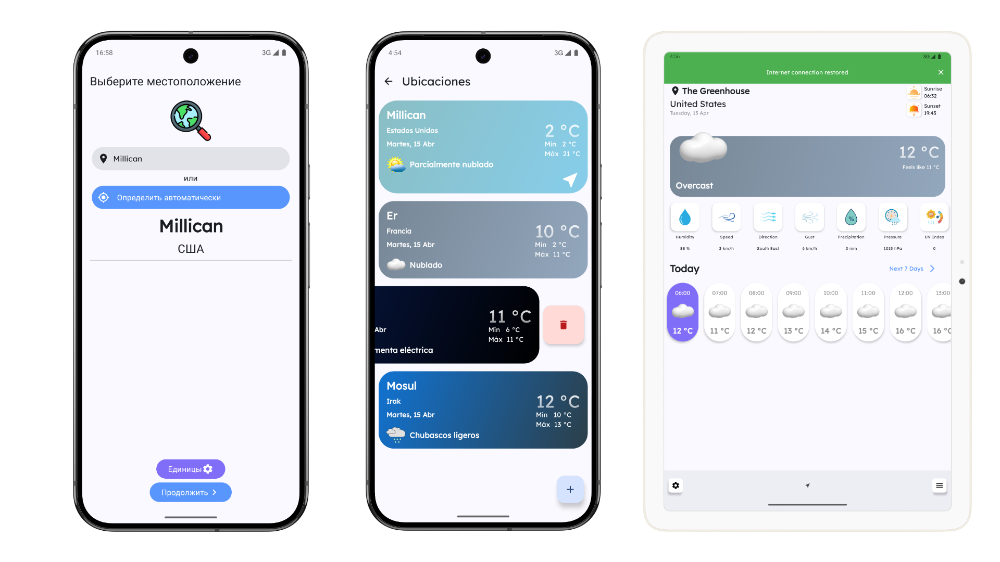

# 🌦️ WeatherApp

Приложение прогноза погоды, разработанное как showcase-проект с использованием современных Android-технологий.

## 📱 Скриншоты




## 🌍 Локализация и адаптивность

Приложение поддерживает **три языка**:
- 🇷🇺 Русский
- 🇪🇸 Испанский
- 🇬🇧 Английский

🖥️ Поддержка **адаптивного дизайна**:
- Смартфоны
- Планшеты
- Складные устройства (Foldables)

📐 Учет **ориентации экрана**:
- Вертикальная (Portrait)
- Горизонтальная (Landscape)

🧩 Гибридный UI:
- Jetpack **Compose** 
- **XML** View Binding

## 🌐 Источники данных

Приложение использует **открытые и бесплатные API**:

- **[Open-Meteo Weather API](https://open-meteo.com/)** — для получения прогноза погоды (температура, ветер, влажность и пр.)
- **[Open-Meteo Geocoding API](https://geocoding-api.open-meteo.com/)** — геокодинг и определение координат по названию города
- **[GeoNames](https://www.geonames.org/)**  — реверс геокодинг. Требуется бесплатный API-ключ:

> 🔐 Для использования GeoNames необходимо получить **бесплатный API-ключ**. Зарегистрируйтесь на [geonames.org](https://www.geonames.org/login) и создайте пользователя, укажите ключ в `gradle.properties`:
>
> ```
> REVERSE_GEOCODING_API_KEY=your_key
> ```

## 🧰 Стек и библиотеки

Проект построен на базе **Kotlin 2+** , **KSP** , **AGP 8.8+**

### 🖼️ UI

- [XML View с ViewBindings](https://developer.android.com/topic/libraries/view-binding)
- [Jetpack Compose](https://developer.android.com/jetpack/compose)
- [Compose ConstraintLayout](https://developer.android.com/jetpack/compose/layouts/constraintlayout)
- [Material 3 Adaptive](https://m3.material.io/foundations/adaptive-design)
- [Material Icons Extended](https://mvnrepository.com/artifact/androidx.compose.material/material-icons-extended)
- [Android SplashScreen](https://developer.android.com/develop/ui/views/launch/splash-screen)
- [ViewBindingPropertyDelegate](https://github.com/androidbroadcast/ViewBindingPropertyDelegate)
- [Android Compose Fragment](https://developer.android.com/develop/ui/compose/migrate/interoperability-apis/compose-in-views)
- [Lottie](https://github.com/airbnb/lottie-android)
- [Adapter Delegates](https://github.com/sockeqwe/AdapterDelegates)


### 🧬 Асинхронность

- [Kotlin Coroutines](https://kotlinlang.org/docs/coroutines-overview.html)
- [Kotlin Flows](https://kotlinlang.org/docs/flow.html#flow-cancellation-basics)

### ♻️ Бэкграунд

- [Work Manager](https://developer.android.com/develop/background-work/background-tasks/persistent/getting-started)


### 📦 DI

- [Dagger Hilt](https://dagger.dev/hilt/)

### 🛰️ Сеть

- [Retrofit](https://square.github.io/retrofit/)
- [OkHttp](https://square.github.io/okhttp/)
- [Kotlinx serialization](https://github.com/Kotlin/kotlinx.serialization)

### 💾 Хранение данных

- [Room](https://developer.android.com/jetpack/androidx/releases/room)
- [Proto Datastore](https://developer.android.com/topic/libraries/architecture/datastore)

### 📍 Геолокация

- [Play Services Location](https://developer.android.com/training/location)

### 🧭 Навигация

- [Navigation Compose](https://developer.android.com/jetpack/compose/navigation)

### 🧱 Виджеты

- [Glance Compose](https://developer.android.com/jetpack/compose/glance)

### 🧪 Тестирование

- [JUnit](https://junit.org/)
- [MockK](https://mockk.io/)
- [Hilt Testing](https://dagger.dev/hilt/testing.html)

### 📅 Работа с датой и временем

- [Kotlinx Date Time](https://github.com/Kotlin/kotlinx-datetime)

### 🎨 Code Style и анализ

- [Detekt](https://detekt.dev/)
- [Detekt Compose Rules](https://github.com/appKODE/detekt-rules-compose)


## 📦 Модули проекта

Проект построен на **модульной архитектуре**, что упрощает масштабирование, повторное использование и тестирование.

### 🔧 Build Logic

- [`build-logic`](https://github.com/wookoowooko/WeatherAppPortfolio/tree/master/build-logic) — Gradle-плагины и конфигурации сборки

### 🚀 Главный модуль

- [`app`](https://github.com/wookoowooko/WeatherAppPortfolio/tree/master/app) — точка входа в приложение, инициализация, навигация

### 🧩 Core-модули

- [`androidresources`](https://github.com/wookoowooko/WeatherAppPortfolio/tree/master/core/androidresources) — строковые ресурсы, переводы (RU, EN, ES)
- [`common`](https://github.com/wookoowooko/WeatherAppPortfolio/tree/master/core/common) — базовые интерфейсы, утилиты
- [`connectivity-observer`](https://github.com/wookoowooko/WeatherAppPortfolio/tree/master/core/connectivity-observer) — мониторинг интернет-соединения
- [`data`](https://github.com/wookoowooko/WeatherAppPortfolio/tree/master/core/data) — общие интерфейсы и реализации репозиториев
- [`database`](https://github.com/wookoowooko/WeatherAppPortfolio/tree/master/core/database) — реализация локального хранилища (Room)
- [`datastore`](https://github.com/wookoowooko/WeatherAppPortfolio/tree/master/core/datastore) — реализация локального хранилища (Proto DataStore)
- [`design-system`](https://github.com/wookoowooko/WeatherAppPortfolio/tree/master/core/design-system) — UI-компоненты и тема (Compose + XML)
- [`domain`](https://github.com/wookoowooko/WeatherAppPortfolio/tree/master/core/domain) — бизнес-логика и use-cases
- [`geolocation`](https://github.com/wookoowooko/WeatherAppPortfolio/tree/master/core/geolocation) — определение координат 
- [`mappers`](https://github.com/wookoowooko/WeatherAppPortfolio/tree/master/core/mappers) — преобразование данных между слоями
- [`models`](https://github.com/wookoowooko/WeatherAppPortfolio/tree/master/core/models) — модели данных (DTO, Domain, UI, Entity)
- [`network`](https://github.com/wookoowooko/WeatherAppPortfolio/tree/master/core/network) — Retrofit, OkHttp, API-интерфейсы
- [`permissions`](https://github.com/wookoowooko/WeatherAppPortfolio/tree/master/core/permissions) — управление runtime-разрешениями
- [`synchronizer`](https://github.com/wookoowooko/WeatherAppPortfolio/tree/master/core/synchronizer) — логика синхронизации данных
- [`widgets`](https://github.com/wookoowooko/WeatherAppPortfolio/tree/master/core/widgets) — виджеты
- [`worker`](https://github.com/wookoowooko/WeatherAppPortfolio/tree/master/core/worker) — фоновые задачи через WorkManager

### 🧩 Feature-модули

Каждый отвечает за конкретный функционал и реализован в стиле feature-based архитектуры:

- [`cities`](https://github.com/wookoowooko/WeatherAppPortfolio/tree/master/features/cities) — поиск и управление списком городов
- [`main`](https://github.com/wookoowooko/WeatherAppPortfolio/tree/master/features/main) — главный экран с текущей погодой
- [`settings`](https://github.com/wookoowooko/WeatherAppPortfolio/tree/master/features/settings) — настройки приложения
- [`weekly`](https://github.com/wookoowooko/WeatherAppPortfolio/tree/master/features/weekly) — экран прогноза на неделю
- [`welcome`](https://github.com/wookoowooko/WeatherAppPortfolio/tree/master/features/welcome) — онбординг

## 🧠 Архитектурный подход

В приложении реализован **кастомный MVI-подход** с элементами Redux, разработанный специально под задачи проекта. Он объединяет **реактивное программирование** с **однонаправленным потоком данных**, обеспечивая предсказуемость, масштабируемость и простоту тестирования.

### 💡 Основные концепции

| Компонент                       | Назначение                                                                 |
|----------------------------------|---------------------------------------------------------------------------|
| **State**                        | Отражает текущее состояние UI (например, WeeklyState)                     |
| **Intent**                       | Действия пользователя или события экрана (например, WeeklyIntent)         |
| **Reducer**                      | Чистая функция, преобразующая State + Intent в новый State                |
| **Effect**                       | Одноразовые побочные действия (например, показ Snackbar, навигация), реализованы через SharedFlow |
| **Store<State, Intent, Effect>** | Централизованный обработчик состояния и эффектов, основанный на корутинах и Flow |
| **ViewModel**                    | Предоставляет UI StateFlow состояния и SharedFlow эффектов                 |

### 🔁 Поток данных

```text
Intent (действие пользователя)
       ↓
  Reducer (бизнес-логика)
       ↓
State (обновлённое состояние UI)
       ↓
   UI обновляется через StateFlow
```

## 🔓 Open Source

Этот проект является **Open Source** — вы можете свободно использовать его как в личных, так и в коммерческих целях, вносить изменения, создавать форки и предлагать улучшения.

Если проект оказался вам полезен, поставьте ⭐️ — это мотивирует поддерживать и развивать его дальше!

Лицензия: [Apache 2.0](LICENSE)
